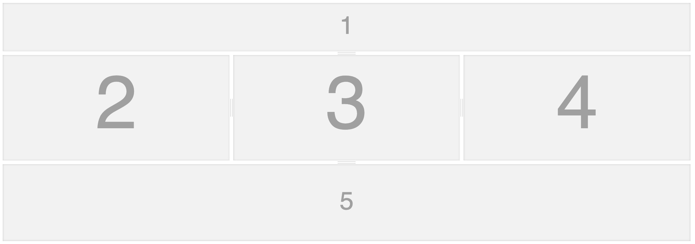

# Svelte-Splitpanes

Use dynamic and predictable view panels to layout an application.



> This library is a port from the excellent [vue-splitpanes](https://antoniandre.github.io/splitpanes/), if you are using this library for business or leasure, please consider [backing the original author](https://github.com/sponsors/antoniandre)!

> While you are at it, you may also [back the developer](https://github.com/sponsors/orefalo) who ported the code to Svelte. :blush:

## Features

- Size is less than 4 kb
- Support both dynamic horizontal and vertical splits
- Support defaults, min and max sizes
- Support multiple splits
- Support lifecyle events
- Support custom divider size and overlay (css)
- Support splitter pane pushing
- Support RTL rendering
- Support first splitter on/off
- Support pane toggle
- Support programmatic resizing
- Support programmatic splitter add/remove
- Support for legacy browser such as IE 11
- Support for touch devices
- Support for fixed splitters
- Sveltekit & Typescript friendly

## Browser Support

|  |  |  |  |  |  |
| ---------------------------------------------------------------------------------------- | ------------------------------------------------------------------------------------------- | ---------------------------------------------------------------------------------------- | ------------------------------------------------------------------------------------- | ---------------------------------------------------------------------------------- | ---------------------------------------------------------------------------------------------------------------------------- |
| Latest ✔                                                                                 | Latest ✔                                                                                    | Latest ✔                                                                                 | Latest ✔                                                                              | Latest ✔                                                                           | 10+ ✔                                                                                                                        |

## Demo & Documentation

* [REPL Demo](https://svelte.dev/repl/1e96cbd4bcd148e3b85a4c8ca76d7309?version=3.48.0)
* [More complex demos and examples](https://orefalo.github.io/svelte-splitpanes/)

## Installation

```shell
$ npm i svelte-splitpanes
```

## Usage

```html
<script>
import { Pane, Splitpanes } from 'svelte-splitpanes';
</script>
<Splitpanes class="default-theme" style="height: 400px">
	<Pane minSize="20">1<br /><em class="specs">I have a min width of 20%</em></Pane>
	<Pane>
		<Splitpanes class="default-theme" horizontal="{true}">
			<Pane minSize="15">2<br /><em class="specs">I have a min height of 15%</em></Pane>
			<Pane>3</Pane>
			<Pane>4</Pane>
		</Splitpanes>
	</Pane>
	<Pane>5</Pane>
</Splitpanes>
```

### API

Here is the list of properties that apply to <Splitpanes>

| Parameter name   | Default                     | Comments                                                                                                     |
| ---------------- | --------------------------- | ------------------------------------------------------------------------------------------------------------ |
| horizontal       | false (Vertical by default) | The orientation of the split panes.                                                                          |
| pushOtherPanes   | true                        | Whether a splitter should push the next splitter when dragging.                                              |
| dblClickSplitter | true                        | Double click on splitter to maximize the next pane                                                           |
| rtl              | false                       | Supports Right to left direction                                                                             |
| firstSplitter    | false                       | Displays the first splitter when set to true. This allows maximizing the first pane on splitter double click |
| id               | undefined                   | Provide an optional id attribute to the component for styling/other reasons                                  |
| theme            | 'default-theme'             | Used to styles the splitters using a different css class                                                     |
| class            | undefined                   | Any additional css classes to be added to the component                                                      |

Properties that apply to <Pane>

| Parameter name | Default   | Comments               |
| -------------- | --------- | ---------------------- |
| minSize        | 0         | minimum pane size in % |
| maxSize        | 100       | maximum pane size in % |
| size           | undefined | pane size in %         |
| class          | undefined | Any additional css classes to be added to the component |

### Styling

The component can be further styled after the props have been defined by overriding the default css styling. The best way to do this is to use a class differenciator or the id="" prop and then scope your global css with this class/id.

```css
/* The followinf classes can be used to style the splitter, see demos*/

.splitpanes {
	background-color: #f8f8f8;
}

.splitpanes__splitter {
	background-color: #ccc;
	position: relative;
}
.splitpanes__splitter:before {
	content: '';
	position: absolute;
	left: 0;
	top: 0;
	transition: opacity 0.4s;
	background-color: rgba(255, 0, 0, 0.3);
	opacity: 0;
	z-index: 1;
}
.splitpanes__splitter:hover:before {
	opacity: 1;
}
.splitpanes--vertical > .splitpanes__splitter:before {
	left: -30px;
	right: -30px;
	height: 100%;
}
.splitpanes--horizontal > .splitpanes__splitter:before {
	top: -30px;
	bottom: -30px;
	width: 100%;
}
```

## Contributing

If you have any idea, feel free to open an issue to discuss an idea or new feature, yuo may also fork Splitpanes and submit your changes back.

### npm package

```shell
# generate the package in /package
npm run package
# publish it (requires to be logged into npm from the cli)
cd package
npm publish --access public
```

### GH Pages

```shell
# generate new site to /docs
$ npm run build-ghpages
# then commit and push changes to git, github will auto publish
```
